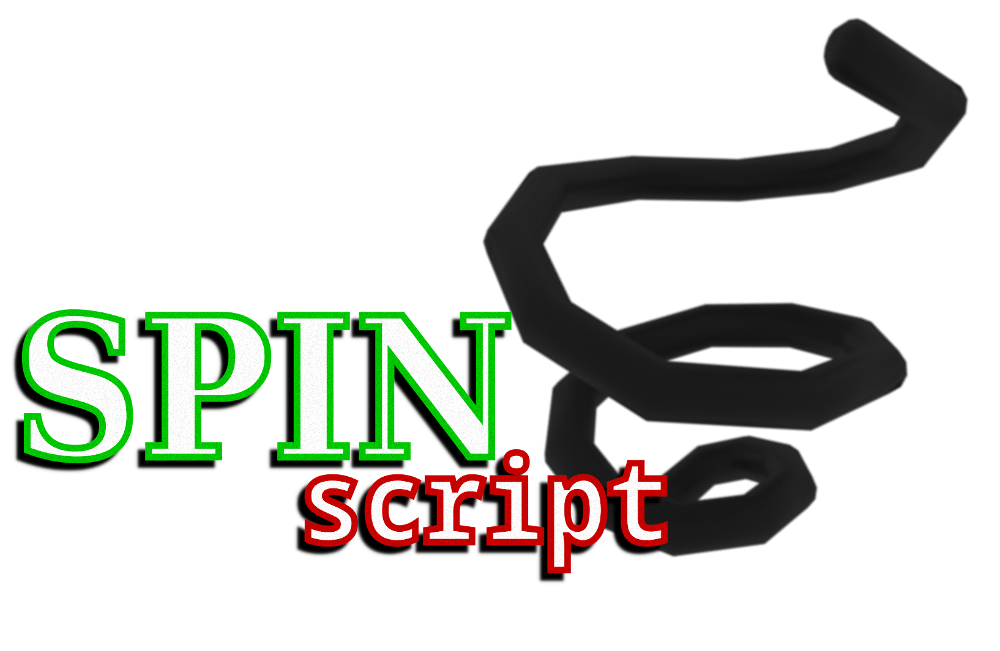

# SPINscript
*SPINscript* is a fantasy *architecture* created by Uneven for the future game title *The Fools from Space*, in which it serves as the programmable embedded CPUs
on most of the equipment the players interact with, allowing them to program automations that shall make their lifes easier.

This architecture is mainly based off the *DCPU-16* (a tribute to Markus Persson *"Notch"* and his 0x10c project) and *Intel 8086* architectures, and keeping up to
the limitations of them and the game's time period, does not offer many instructions and memory as one would have today.

**TTSVM** emulates all of the behaviour the architecture has, and is the goto for anyone who wishes to implement the architecture for other stuff. Included is also 
the **Paraphenalia** compiler (CURRENTLY BEING REDONE!!!), which compiles down the assembly you write into bytecode that **TTSVM** can interpret.

The full specifications for the system and instructions can be found in `SPECS`!

## What does SPIN in SPINscript stand for?
It stands for **Specially Powerful Incredibly Nonsensical**. Yep.

## How do I run some scripts?
Run make for `parasc` & `ttsvm`, compile the example script with `parasc example.spin` then run `ttsvm example.spc`! (THIS HAS YET TO BE DONE.)

